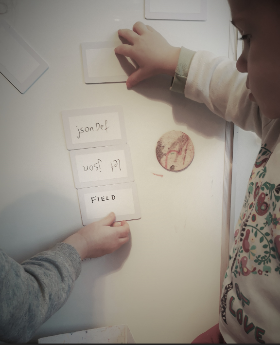
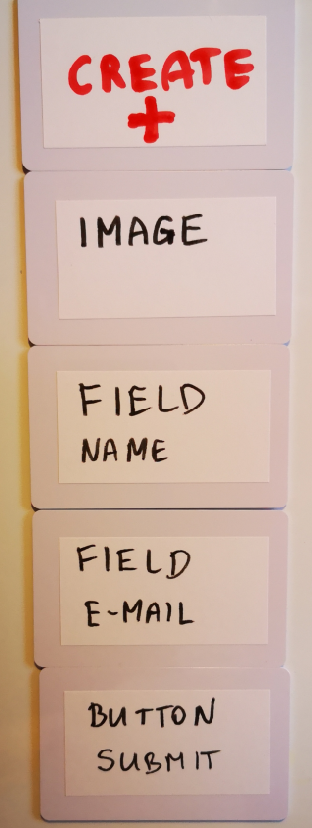

# [WebStream](https://www.webstream.dev/)
Streaming application/interface directly on frontend, withoud building backend side

## Current Technologies at 2021
+ Single Page Application (SPA)
+ Progressive Web App (PWA)
+ Application as a Stream (AaaS)
    + javascript    
    + native
    + json based communication
    
## AaaS - Application as a Stream

Supported by WebStream.
WebStream is an ecosystem for web-development

## How WebStream work's?

Load any media on website without reload page, now stream each website without reload.
Over modularity each website can talk to another without barrier...

### Supported media

    html
    txt
    markdown
    mp3
    wav
    js

# Powstanie
w związku z rozwojem bilbioteki i modularyzacją samej biblioteki potrzebny był wspólny mianownik do połączenia narzędzi tworzących ekosystem do streamowania interface-ów aplikacji webowej.

## Moduły WebStream

[Strona projektu WebStream](https://www.webstream.dev/)

### letJson()
pobieranie samego jsona

### jsonDef()
okreslanie oczekiwanej struktury oraz podłączenie każdego elementu JSON pod konrketną funkcję

### jBodys()

### jLoads()

ładowanie konkretnych url do formatu wyświetlanego w HTML bez okreslenia miejsca gdzie ma być załadowane,
pliki będą tylko definiowały same zależnosci:

      {
        "/form/field/text.css",
        "/form/field/email.css",
        "/form/field/submit.css",
        "newsletter.html": [
            "submit.js"
        ]
      }

### jRoutes()
pipelines (event, from, to) definicja miejsc, gdzie i co ma być z czym połączone z jLoads na HTML

### jPaths()

routing dla url
+ praca z adresami url
+ event listener

### jRuns()

devops part
+ deployment
+ monitoring

## Ekosystem do streamowania

Poniższe funkcje pozwalają na implementację tych rozwiazań w kilku językach programowania

## Funkcja

+ letJson
+ jsondef
+ jBodys
+ jLoads
+ jRoutes

## język programowania:

#### JavaScript
+ domena: js.[funkcja].com

#### PHP
+ domena: php.[funkcja].com

#### Python
+ domena: py.[funkcja].com

# Modularyzacja
[Modularyzacja przy wytwarzaniu oprogramowania.](https://www.hipermodularyzacja.pl/)

## Ogólne Dane

### Logo
+ logo.[funkcja].com

### Dokumentacja
+ docs.[funkcja].com

## per Moduł

### Pobranie, paczka
+ get.[język].[funkcja].com

### Edycja, repozytorium git
+ git.[język].[funkcja].com

# Moduły

### let json

ładowanie JSON 

### json def

### jBodys

### jLoads

### jRoutes

# Media

Ładowanie mediów tekstowych, kodu aplikacji, filmów, głosu, itp.

+ html
+ txt
+ markdown
+ mp3
+ wav
+ js
+ php
+ python

# Examples

## Tworzenie aplikacji offline poprzez karty (NFC)

It works online but You can create it offline, by NFC cards with your handy, without any application.

## Przykładowa aplikacja

sczytujemy kolejno karty od góry do dołu poprzez czytnik NFC (poprzez smartfon'a) i kolejno są otwierane adresy, które są identyfikowane jako kolejne elementy (identyfikacja adresu IP), równocześnie powstaje strona www oparta o te moduły. Lista modułów jest zapisana w JSON, ładowane są za pomocą rozwiązania WebStream .dev , wcześniej biblioteka jLoads, teraz kilka modularnych funkcji docelowo na kilka jezyków, dzięki czemu nie będzie problemu z implementacją w python, php, itd

